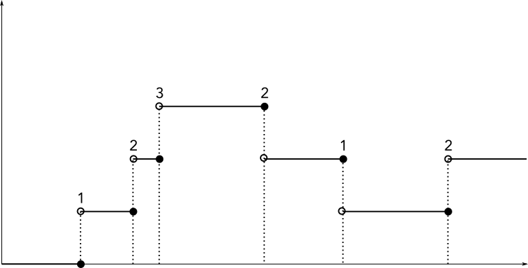
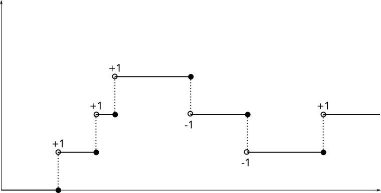

Behaviors
================================================================================

Handling events by installing event handlers – or callbacks – is the
conventional way of GUI programming – widely used by in ecosystems ranging from
C to JavaScript. This approach does not scale well, and is usually referred to
as »Callback Hell«.

To escape Callback Hell, FRP has introduced a second building block:
[`Behavior`].

While `Event` encodes a stream of discrete events, a [`Behavior`] encodes a
continuous value that changes over time. Mathematically, You can think of a
`Behavior a` as a continuous function `Time -> a`, whereas an `Event a` is
rather a discrete `Map Time a`.

Behaviors are usually constructed from Events, via two main concepts:
* Stepping ([`stepper`]): The behavior changes every time an event occurs, and
  takes the value of the event and and holds it until the next event. 
* Accumulation ([`accumB`]): Events are functions, `Event (a -> a)`, and with
  every event, the function is applied to the current value of the behavior,
  yielding the new value. 

[`Behavior`]: https://hackage.haskell.org/package/threepenny-gui-0.9.0.0/docs/Reactive-Threepenny.html#t:Behavior
[`stepper`]: https://hackage.haskell.org/package/threepenny-gui-0.9.0.0/docs/Reactive-Threepenny.html#v:stepper
[`accumB`]: https://hackage.haskell.org/package/threepenny-gui-0.9.0.0/docs/Reactive-Threepenny.html#v:accumB

A few tools for working with Events and Behaviors
--------------------------------------------------------------------------------

* In order to avoid variable name clashes, it is common to follow a naming schema:

        eFoo :: Event a
        bFoo :: Behavior a

* [`<$>`] applies a function inside an event or behavior:

        bFoo            :: Behavior Int
        show <$> bFoo   :: Behavior String

    Note that `<$>` is just the same as `fmap`, written as an infix operator. So
    the above is identical to

        fmap show bFoo  :: Behavior String

* [`<$`] is similar to [`<$>`], but ignores the previous value of the event.
  I'ts most useful to apply actions every time an event happens, e.g.:

        eClick                :: Event ()
        "Hello"  <$ eClick    :: Event String
        (++ "x") <$ eClick    :: Event (String -> String)

* Use [`unionWith`] to combine two events into one. You need to supply a
  function that combines two events in case they happen simultaneously. The most
  common case is applying the actions one after the other:

        unionWith (.) eFoo eBar

* Use [`sink`] to link an attribute to a behavior:

        element e # sink UI.text bText

[`<$>`]: https://hackage.haskell.org/package/threepenny-gui-0.9.0.0/docs/Graphics-UI-Threepenny-Core.html#v:-60--36--62-
[`<$`]: https://hackage.haskell.org/package/threepenny-gui-0.9.0.0/docs/Graphics-UI-Threepenny-Core.html#v:-60--36-
[`unionWith`]: https://hackage.haskell.org/package/threepenny-gui-0.9.0.0/docs/Graphics-UI-Threepenny-Core.html#v:unionWith
[`sink`]: https://hackage.haskell.org/package/threepenny-gui-0.9.0.0/docs/Graphics-UI-Threepenny-Core.html#v:sink

Exercise
--------------------------------------------------------------------------------

Implement a counter that can be incremented and decremented via »+«/»-« buttons.
